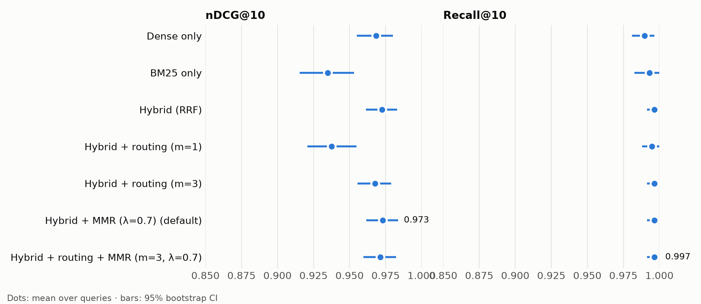

# Meridian

Hybrid RAG pipeline with MMR re-ranking and an evaluation harness that measures every retrieval stage.

Documents are chunked along their structure, embedded with Voyage AI (dense) and BM25 (sparse), and
indexed in Qdrant. Queries run both branches, fuse them with reciprocal rank fusion, and re-rank with
MMR. Claude writes the answer, citing the retrieved chunks. An optional cluster-routing stage can restrict
the dense branch to the nearest topic clusters; it is off by default because the evaluation found it cost
accuracy (see [Design rationale](#design-rationale)).

## Setup

Requires Python 3.11+ and Docker.

```bash
python -m venv venv && source venv/bin/activate
pip install -e ".[dev]"
docker compose up -d --wait          # Qdrant on localhost:6333
cp .env.example .env                 # then fill in both keys
```

`.env` needs two keys:

| Variable | Used for |
|---|---|
| `MERIDIAN_VOYAGE__API_KEY` | Dense embeddings (Voyage AI) |
| `MERIDIAN_GENERATION__API_KEY` | Answer and eval-query generation (Claude). Use a workspace-scoped key. |

### Running without a paid Voyage account

Voyage accounts without a payment method are limited to 3 requests and 10K tokens per minute. Without
pacing, the default batch size exceeds that and embedding fails after its retries. Turn on client-side
pacing, which caps batch size at the token budget and spaces requests to fit both limits:

```bash
export MERIDIAN_VOYAGE__REQUESTS_PER_MINUTE=3
export MERIDIAN_VOYAGE__TOKENS_PER_MINUTE=6000
```

Use 6000, not the nominal 10K: Voyage rejected every ~9K-token batch even though it billed them at the
same token count we measure locally, while 6K batches went through with zero retries.

Everything still works, just slower: ingesting the full corpus takes several minutes instead of seconds.
Adding a payment method lifts the limits (Voyage's free token allowance still applies).

## Usage

```bash
meridian ingest              # chunk, embed, and index data/corpus/documents.jsonl (incremental)
meridian recluster           # fit topic clusters (needed only for cluster routing and `meridian eval`)
meridian serve               # HTTP API: POST /v1/retrieve, POST /v1/answer (streamed, cited)
```

## Evaluation

```bash
meridian build-eval-set      # Claude writes single- and multi-document queries -> data/eval/queries.jsonl
meridian eval                # ablation -> docs/eval_results.md, updates the section below
```

<!-- eval:start -->
_290 queries over 359 chunks from 204 documents · generated 2026-09-27 00:01 UTC by `meridian eval` · full report: [docs/eval_results.md](docs/eval_results.md)_

<picture>
  <source media="(prefers-color-scheme: dark)" srcset="docs/assets/eval_results_dark.png">
  
</picture>

| Configuration | nDCG@10 [95% CI] | Δ nDCG vs hybrid [95% CI] | Recall@5 | Recall@10 | MRR@10 | Distinct docs@10 | p50 latency |
|---|---|---|---|---|---|---|---|
| Dense only | 0.968 [0.955, 0.980] | -0.004 [-0.016, +0.007] | 0.969 | 0.990 | 0.978 | 6.7 | 6.9 ms |
| BM25 only | 0.935 [0.915, 0.953] | -0.038 [-0.053, -0.023] | 0.967 | 0.993 | 0.926 | 7.5 | 5.1 ms |
| Hybrid (RRF) | 0.972 [0.961, 0.983] | — | 0.983 | 0.997 | 0.977 | 7.0 | 9.3 ms |
| Hybrid + routing (m=1) | 0.938 [0.921, 0.955] | -0.035 [-0.049, -0.022] | 0.978 | 0.995 | 0.931 | 6.9 | 15.8 ms |
| Hybrid + routing (m=3) | 0.968 [0.956, 0.979] | -0.005 [-0.012, +0.002] | 0.983 | 0.997 | 0.971 | 7.0 | 12.7 ms |
| Hybrid + MMR (λ=0.7) (default) | **0.973 [0.961, 0.984]** | +0.000 [-0.005, +0.006] | 0.984 | 0.997 | 0.975 | 8.2 | 35.0 ms |
| Hybrid + routing + MMR (m=3, λ=0.7) | 0.971 [0.960, 0.982] | -0.001 [-0.008, +0.004] | 0.984 | 0.997 | 0.973 | 8.2 | 52.0 ms |
<!-- eval:end -->

## Design rationale

Each retrieval stage started as a hypothesis, and the evaluation harness exists to test them: it turns
each stage on and off against the same index and the same query embeddings, so a difference between rows
comes from that stage alone. The numbers below come from the table above (290 queries, 359 chunks, k=10)
and the per-source breakdown in [docs/eval_results.md](docs/eval_results.md). Every claim below held in
two separate runs of the full eval.

**Hybrid search (dense + BM25, fused with reciprocal rank fusion): kept.** Dense embeddings match
meaning; BM25 matches exact terms like algorithm names and acronyms. Of the three retrieval methods,
hybrid is the only one near the top on every query type. On multi-document queries it retrieves 96.7% of
the relevant documents, against 90.0% for dense search alone, and overall it beats BM25 alone by 0.038
nDCG@10 (95% CI 0.023 to 0.053).

**MMR re-ranking (λ = 0.7): kept, and on by default.** The corpus deliberately includes near-duplicate
"mirror" articles, which fill the top results with repeated content. MMR raises the number of distinct
documents in the top 10 from 7.0 to 8.2, with no measurable effect on ranking quality: the change in
nDCG@10 is indistinguishable from zero (95% CI −0.005 to +0.006). It adds some latency, though the laptop
timings here are too noisy to put a precise number on it.

**Cluster routing: tested, and the eval disproved it at this scale.** The hypothesis was that restricting
dense search to the query's nearest topic clusters would cut noise from unrelated topics. The clusters
themselves are sound: 81% of chunks land in a cluster whose majority topic is their own, without the
clusterer ever seeing topic labels. But routing loses relevant documents that sit in a neighbouring
cluster. Routing to 1 cluster clearly hurts: it cost 0.032 and 0.035 nDCG@10 in two runs, with confidence
intervals well below zero both times. Routing to 3 clusters never helped. It cost about 0.005, which is
within run-to-run noise (95% CI −0.012 to +0.002 in the latest run). Both settings add latency. The harness
was built partly to validate this design choice, and it did its job by rejecting it. With about 360
chunks, searching everything is already fast, so routing has nothing to save. It might pay off on an index
large enough that exhaustive search is expensive, but that is untested. Routing therefore ships **off by
default**. It remains implemented, and every eval run still measures it (routing to 1 and to 3 clusters,
and routing combined with MMR). To turn it on, set `MERIDIAN_RETRIEVAL__ROUTE_TOP_M=3` (the number of
clusters to search) and run `meridian recluster` first.

**How far to trust these numbers**

- The multi-document results rest on only 30 queries, which have 60 relevant documents between them:
  96.7% versus 90.0% is 58 versus 54 documents found. The per-source breakdown has no confidence
  intervals, so treat multi-document differences as indicative, not established.
- Reruns on the same index are not bit-identical. Between two runs, BM25 scores changed for 3 of the 290
  queries (one was an exact tie between a mirror and its original), shifting nDCG means by up to 0.005.
  The exact cause is not pinned down. Treat differences smaller than about 0.005 as noise.
- Single-document queries are near ceiling (Recall@10 is 1.0 for almost every configuration), so they
  barely separate the configurations.
- Claude generated the queries from corpus passages, and only each query's source documents count as
  relevant. The full list of caveats is in [docs/eval_results.md](docs/eval_results.md#caveats).

## Tests

```bash
pytest                       # unit tests (no network)
pytest -m integration        # live Qdrant + Voyage + Claude on throwaway collections
```

## License

The source code is available under the [PolyForm Strict License 1.0.0](LICENSE). You may read it and
run it for noncommercial purposes. You may not distribute it, modify it, or build on it, and commercial use
is not permitted.

The corpus in `data/corpus/` is not covered by that license. Wikipedia text there is licensed under
[CC BY-SA 4.0](https://creativecommons.org/licenses/by-sa/4.0/), and arXiv metadata is dedicated to the
public domain under CC0 1.0. Each record names its source URL and license.
